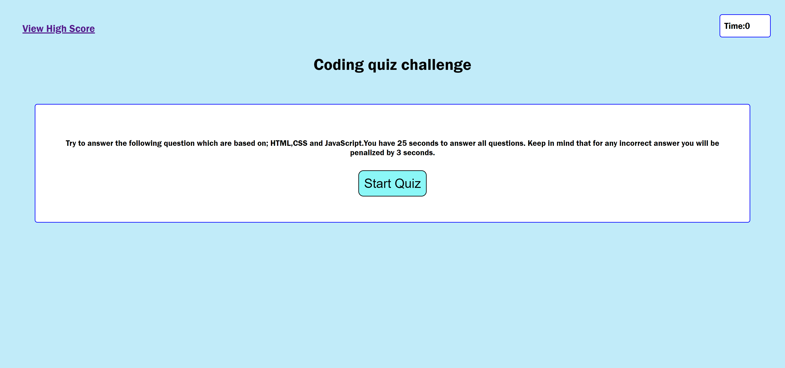

# coding-quiz-challenge

## Overview

For this project my aim was to create an interactive coding quiz challenge from scratch using Javascript and Web APIs.

Deployed Link: https://asmaamusse.github.io/coding-quiz-challenge/

GitHub page: https://github.com/AsmaaMusse/coding-quiz-challenge/tree/dev

### What did i do?

- I created a timed quiz using javaScript.
- I ensured the page stores the users highscores and the user has access to the data.

### Technologies used:

-HTML
-CSS
-JavaScript
-Web APIs

## Screenshots:

JS Code

